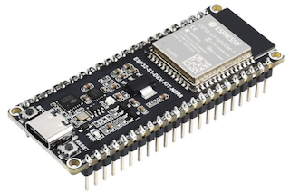
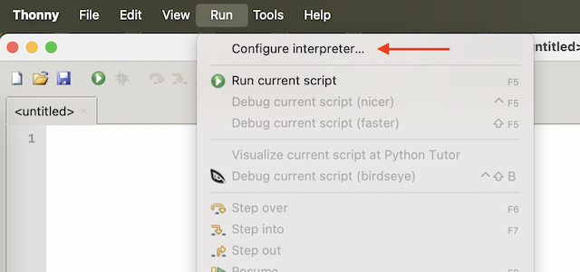
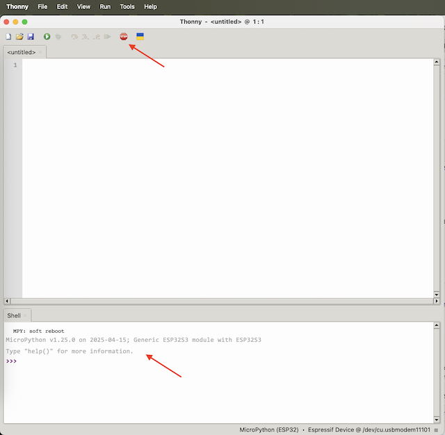

# ESP32

The [ESP32-S3](https://www.waveshare.com/wiki/ESP32-S3-DEV-KIT-N8R8) is a compact-size microcontroller development board. A wide range of sensors and actuators can be connected to the board through its available GPIO pins. Throughout these lessons, you will code the ESP32 to access the sensors and actuators using [Micropython](https://micropython.org).



## Setup

To program the ESP32-S3, you will use the [Thonny IDE](https://thonny.org). Below are the initial steps and configurations needed to create and upload your code to the ESP32-S3 board.

1. Connect the ESP32-S3 board to your computer.

1. Open the Thonny IDE on your computer.

1. In `Run` menu chosse `Configure interpreter`. Select `MicroPython (ESP32)` as the interpreter and `Espressif Device @ ...` as port.




4. Use the `Stop` button and verify that MicroPython is correctly running on the board.



## Hello world

It is traditional when starting out with a new programming language or technology to create a 'Hello World' application - a small application that outputs something like the text `"Hello World"` to show that all the tools are correctly configured.

### Task - Create a MicroPython ´Hello world´ example

1. Add the following code to a file in Thonny IDE:

    ```python
    print('Hello World!')
    ```

    The `print` function prints whatever is passed to it to the console.

1. Save the file as `main.py` to the ESP32 board by selecting the `Save` option from the `File` menu and choosing `MicroPython device` as the destination.

1. Run the code by using using the `Run current script` from `Run` menu

    The following will be presented in the `Shell` Thonny window:

    ```
    >>> %Run -c $EDITOR_CONTENT

        MPY: soft reboot
        Hello World!
    >>> 
    ```

😀 Your 'Hello World' program was a success!

> 💁 You can find this code in the [code/esp32](code/esp32) folder.

😀 Your connection to the hardware was a success!
