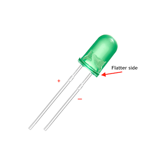
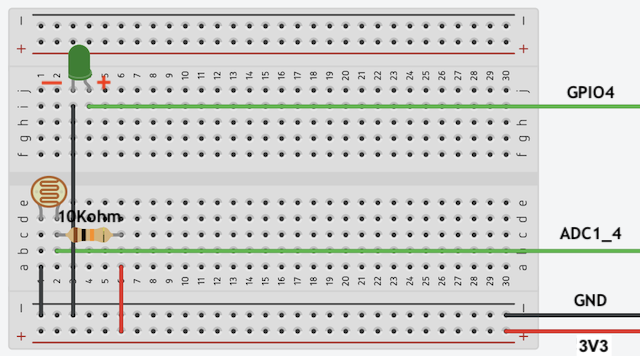

# Build a nightlight - ESP32

In this part of the lesson, you will add an LED to your ESP32 board and use it to create a nightlight.

## Hardware

The nightlight now needs an actuator.

The actuator is an **LED**, a [light-emitting diode](https://wikipedia.org/wiki/Light-emitting_diode) that emits light when current flows through it. This is a digital actuator that has 2 states, on and off. Sending a value of 1 turns the LED on, and 0 turns it off. The LED is an external actuator and needs to be connected to the ESP32 board.

The nightlight logic in pseudo-code is:

```output
Check the light level.
If the light is less than 2047
    Turn the LED off
Otherwise
    Turn the LED on
```

### Task - Connect the LED

LEDs are light-emitting diodes, and diodes are electronic devices that can only carry current one way. This means the LED needs to be connected the right way round, otherwise it won't work.

One of the legs of the LED is the positive pin, the other is the negative pin. The LED is not perfectly round and is slightly flatter on one side. The slightly flatter side is the negative pin. When you connect the LED to the ESP32 board, make sure the leg by the rounded side is connected to the pin that you want to control in your code, and the flatter side is connected to the **GND** pin of the board.



1. Disconnect the ESP32 board from the computer.

1. Using a breadboard and jumper wires, connect the LED to the appropriate pins on the ESP32, following the diagram below.



## Program the nightlight

The nightlight can now be programmed using the light sensor and the LED.

### Task - program the nightlight

Program the nightlight.

1. Connect the ESP32 to the computer.

1. In Thonny, open the file that contains the code for the light sensor.

1. Change the following code to import the required library.

    ```python
    from machine import ADC, Pin
    ```

    The `Pin` library has code to interact with digital devices.

1. Add the following code after the `light_sensor` declaration to create an instance of the class that manages a digital pin:

    ```python
    led = Pin(4, Pin.OUT)
    ```

    The line `led = Pin(4, Pin.OUT)` creates an instance of the `Pin` class connecting to pin **GPIO4** - the digital pin that the LED is connected to. Digital pins can be configured as either `input` (**Pin.IN**) or `output` (**Pin.OUT**), depending on the type of device being controlled through the pin.

1. Add a check inside the `while` loop, and before the `time.sleep` to check the light levels and turn the LED on or off:

    ```python
    if light < 2047:
        led.off()
    else:
        led.on()
    ```

    This code checks the `light` value. If this is less than 2047 it calls the `off` method of the `led` class which sends a digital value of 0 to the LED, turning it off. If the light value is greater than or equal to 2047 it calls the `on` method, sending a digital value of 1 to the LED, turning it on.

    > 💁 This code should be indented to the same level as the `print('Light level:', light)` line to be inside the while loop!

    > 💁 When sending digital values to actuators, a 0 value is 0V, and a 1 value is the max voltage for the device. For the ESP32, the 1 voltage is 3.3V.

1. Save the file to the `MicroPython device` and run the code:

    Light values will be output to the `Shell` Thonny window.

    ```output
    >>> %Run -c $EDITOR_CONTENT

    MPY: soft reboot 
    Light level: 1034
    Light level: 1034
    Light level: 1034
    Light level: 130
    Light level: 4095
    Light level: 2090
    ```

1. Cover and uncover the light sensor. Notice how the LED will light up if the light level is 2047 or greater, and turn off when the light level is less than 2047.

    > 💁 If the LED doesn't turn on, make sure it is connected the right way round.

> 💁 You can find this code in the [code-actuator/esp32](code-actuator/esp32) folder.

😀 Your nightlight program was a success!
