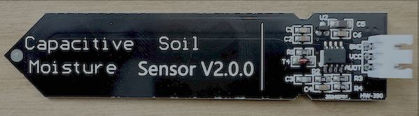
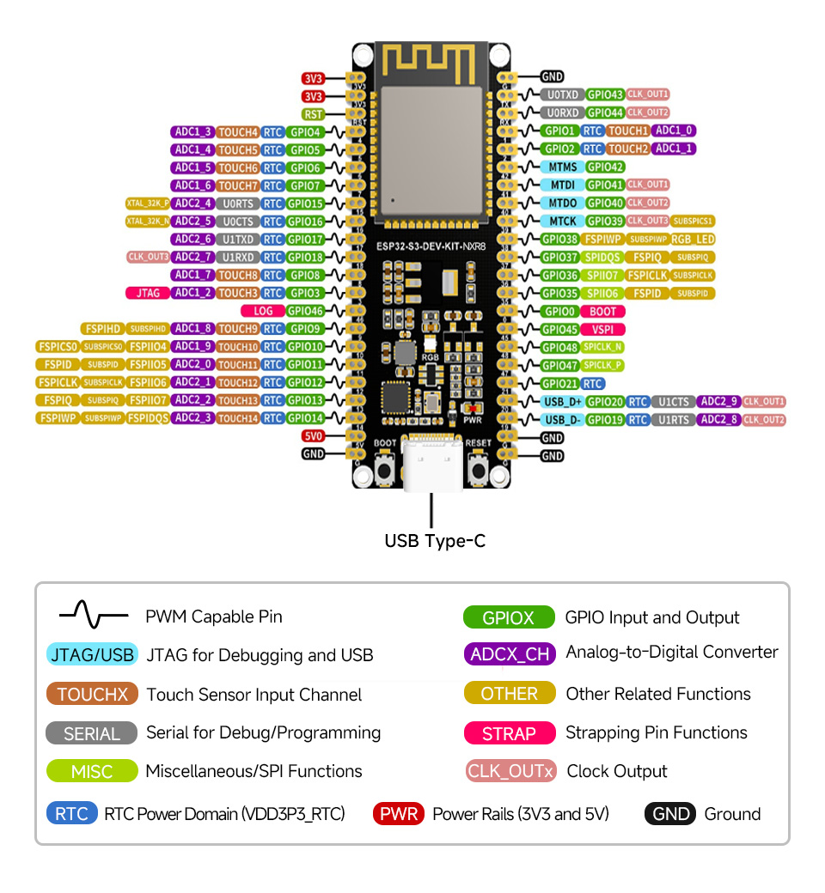
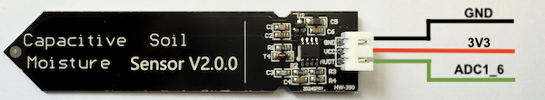

# Measure soil moisture - ESP32

In this part of the lesson, you will add a capacitive soil moisture sensor to your ESP32, and read values from it.

## Hardware

The sensor you'll use is a Capacitive Soil Moisture Sensor, that measures soil moisture by detecting the capacitance of the soil, a property than changes as the soil moisture changes. As the soil moisture increases, the voltage decreases.



This is an analog sensor, so uses an analog pin, and the 12-bit ADC in the ESP32 to convert the voltage to a digital signal from 0-4095.

### Connect the soil moisture sensor

The soil moisture sensor that is used needs to be connected to the ESP32 board pins. The pinout diagram helps you choose the appropriate pins for connecting sensors by showing the function of each pin on the board.



#### Task - connect the soil moisture sensor

1. Disconnect the ESP32 board from the computer.

1. Using a [breadboard](https://www.elecrow.com/blog/how-to-use-a-breadboard-for-beginners.html) and [jumper wires](https://blog.sparkfuneducation.com/what-is-jumper-wire), connect the soil moisture sensor to the appropriate pins on the ESP32, following the diagram below.



3. Insert the soil moisture sensor into soil. It has a 'highest position line' - a white line across the sensor. Insert the sensor up to but not past this line.


## Program the soil moisture sensor

The ESP32 can now be programmed to use the attached soil moisture sensor.

### Task - program the soil moisture sensor

Program the ESP32.

1. Connect the ESP32 to the computer.

1. Using Thonny create a new file.

1. Add the following code to the file to import some required libraries:

    ```python
    import time
    from machine import ADC
    ```

    The `import time` statement imports the `time` module that will be used later in this assignment. The `from machine import ADC` statement imports the `ADC` module from the MicroPython libraries. This library has code to interact with analog sensors.

1. Add the following code below this to create an instance of the `ADC` class:

     ```python
    adc = ADC(7, atten=ADC.ATTN_11DB)
    ```

    The line `adc = ADC(7, atten=ADC.ATTN_0DB)` creates an instance of the `ADC` class connecting to pin **ADC1_6** - the analog pin that the soil moisture sensor is connected to. **The pin numbers used in the code correspond to the GPIO pinout mapping of the ESP32.** The parameter `atten=ADC.ATTN_11DB` sets the attenuation level to adjust the voltage range, ensuring that the measured values are properly scaled according to the electronic circuit.

1. Add an infinite loop that reads from this ADC on the pin, and write the result to the console. This loop can then sleep for 1 seconds between reads.

    ```python
    while True:
        soil_moisture = adc.read()
        print("Soil moisture:", soil_moisture)

        time.sleep(1)
    ```

    This will read the soil moisture level on a scale of 0-4095 using the `read` property of the `ADC` class. This property reads the analog value from the pin. This value is then printed to the console.

1. Save the file to the `MicroPython device` and run the code:

    Soil moisture values will be output to the `Shell` Thonny window:

    ```output
    >>> %Run -c $EDITOR_CONTENT

    MPY: soft reboot 
    Soil moisture: 3418
    Soil moisture: 3381
    Soil moisture: 3397
    Soil moisture: 1407
    Soil moisture: 1391
    Soil moisture: 1398
    Soil moisture: 3381
    ```

    In the example output above, you can see the voltage drop as water is added.

> 💁 You can find this code in the [code/esp32](code/esp32) folder.

😀 Your soil moisture sensor program was a success!
