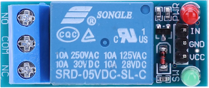
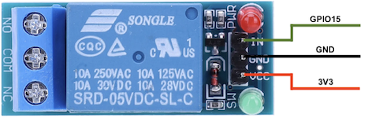

# Control a relay - ESP32

In this part of the lesson, you will add a relay to your ESP32 in addition to the soil moisture sensor, and control it based off the soil moisture level.

## Hardware

The relay you'll use is a normally-open(NO)/close(NC) relay (meaning the output circuit is open/close when there is no signal sent to the relay) that can handle output circuits up to 250V and 10A.



This is a digital actuator, so connects to a digital pin on the ESP32.

### Connect the relay

The relay sensor that is used needs to be connected to the ESP32 board pins. The pinout diagram helps you choose the appropriate pins for connecting sensors by showing the function of each pin on the board.


#### Task - Connect the relay

1. Disconnect the ESP32 board from the computer.

1. Using a [breadboard](https://www.elecrow.com/blog/how-to-use-a-breadboard-for-beginners.html) and [jumper wires](https://blog.sparkfuneducation.com/what-is-jumper-wire), connect the soil moisture sensor to the appropriate pins on the ESP32, following the diagram below.



3. Leave the soil moisture sensor connected to the **ADC1_6** pin, as in the previous lesson, and insert it into the soil.


## Program the relay

The ESP32 can now be programmed to use the attached soil moisture sensor and the relay.

### Task

Program the ESP32.

1. Connect the ESP32 to the computer.

1. Using Thonny open the file from the last lesson. You will be adding to this file.

1. Change the following code to import the required library.

    ```python
    from machine import ADC, Pin
    ```

    The `Pin` library has code to interact with digital devices.

1. Add the following code below the declaration of the `ADC` class to create an instance of the class that manages a digital pin:

    ```python
    relay = Pin(15, Pin.OUT)
    ```

    The line `relay = Pin(15, Pin.OUT)` creates an instance of the `Pin` class connecting to pin **GPIO15** - the digital pin that the relay is connected to.

1. To test the relay is working, add the following to the `while True:` loop:

    ```python
    relay.on()
    time.sleep(.5)
    relay.off()
    ```

    The code turns the relay on, waits 0.5 seconds, then turns the relay off.

1. Save the file to the `MicroPython device` and run the code. The relay will turn on and off every second, with a half second delay between turning on and off. You will hear the relay click on then click off. An green LED on the relay board will be off when the relay is on, and on when the relay is off.

## Control the relay from soil moisture

Now that the relay is working, it can be controlled in response to soil moisture readings.

### Task

Control the relay.

1. Delete the 3 lines of code that you added to test the relay. Replace them with the following code:

    ```python
    if soil_moisture > 2047:
        print("Soil Moisture is too low, turning relay on (green LED off).")
        relay.on()
    else:
        print("Soil Moisture is ok, turning relay off (green LED on).")
        relay.off()
    ```

    This code checks the soil moisture level from the soil moisture sensor. If it is above 2047, it turns on the relay, and turns it off when it goes below 2047.

1. Save the file to the `MicroPython device` and run the code. You will see the relay turn on or off depending on the soil moisture level.

    ```output
    >>> %Run -c $EDITOR_CONTENT

    MPY: soft reboot
    Soil Moisture: 3342
    Soil Moisture is too low, turning relay on (green LED off).
    Soil Moisture: 3319
    Soil Moisture is too low, turning relay on (green LED off).
    Soil Moisture: 1209
    Soil Moisture is ok, turning relay off  (green LED on).
    ```

> 💁 You can find this code in the [code-relay/esp32](code-relay/esp32) folder.

😀 Your soil moisture sensor controlling a relay program was a success!
